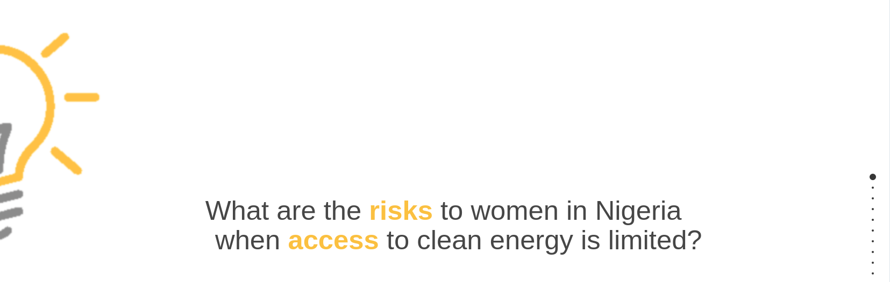
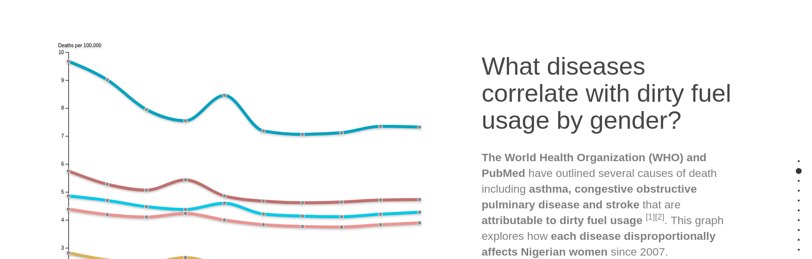
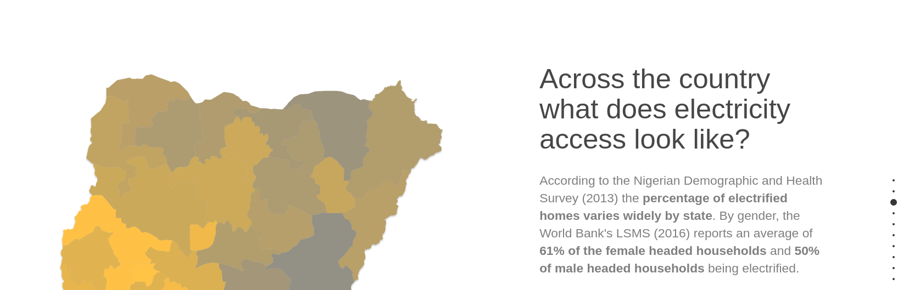
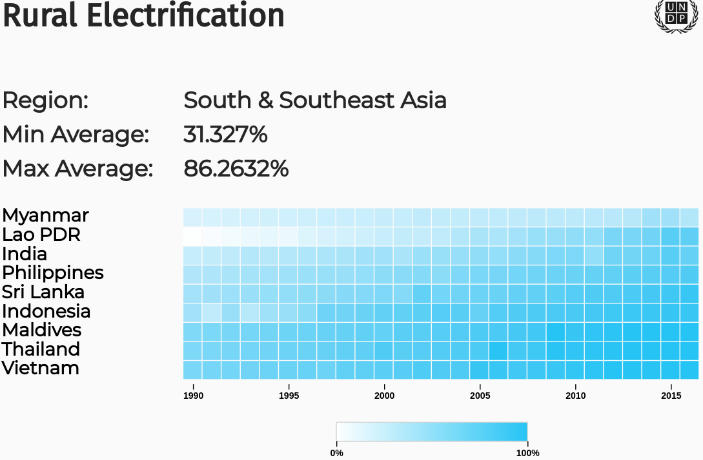
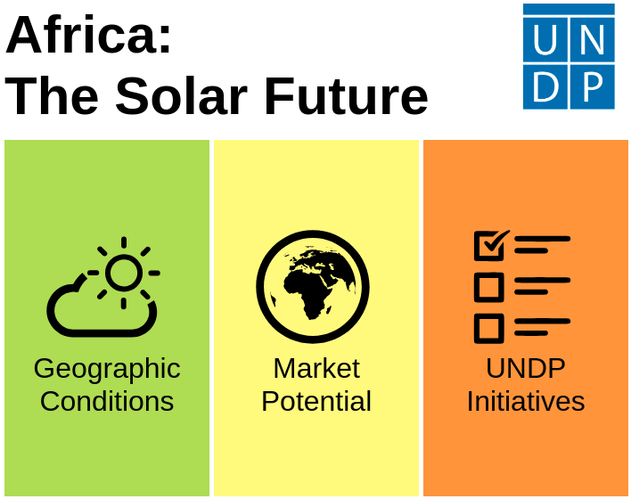

  <b style="color:blue;">Michael Wolf</b>
   
  <b>Data Visualizer &#183; Teacher &#183; Technologist</b>

----
## Risks to Nigerian Women - UNDP SDG Advocacy

----
## World Electrification Heatmap

----
## Africa's Solar Future - UNDP SDG Prototype

----
## Imagine Brooklyn - Ethnographic Research and Presentation

----
## Alcoholics Anonymous - Mapping & AWS DynamoDB (Repo Only)

----
# Code Repositories
[Machine Learning - Model Creation for Amazon Recommendations](https://github.com/wolfm2/jobin/tree/master/minibook/amazon.2.1)

[Machine Learning - Image Recognition](https://github.com/wolfm2/jobin/tree/master/minibook/plane_test)

[Pedagogy - Code Snippets for OpenFrameworks](https://github.com/wolfm2/oF_Examples)

[Research - Contributions to Daniel Sauter's Ketai Processing/Android Library](https://github.com/wolfm2/ketai)

